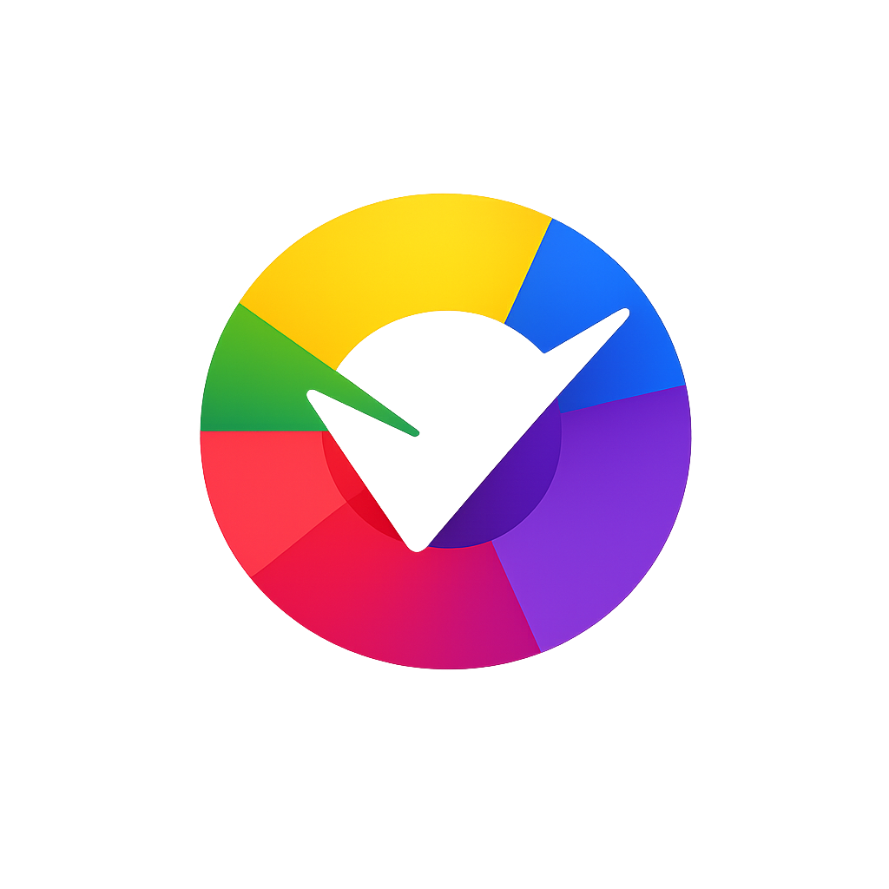

# 🎨 Chromix Pro

<div align="center">
  
  <h3>أداة احترافية لتوليد أنظمة تنسيق الألوان</h3>
  <p>اختر لوناً واحداً، واحصل على 9 أنظمة لونية متكاملة</p>
  
  [](https://اسم-المستخدم.github.io/chromix-pro/)
  [](https://github.com/اسم-المستخدم/chromix-pro)
</div>

---

## ✨ المميزات

| 🎯 النظام اللوني | 🛠️ الأدوات | 🎨 التحويلات |
|----------------|------------|-------------|
| أحادي اللون | نسخ لون واحد | HEX |
| تكاملي | نسخ كل الألوان | RGB |
| متجاور | حفظ المفضلة | HSL |
| ثلاثي | تصدير CSS | CMYK |
| رباعي | الوضع المظلم | |
| تكاملي منقسم | عكس الألوان | |
| مربع | مشاركة البالت | |
| تدرج داكن | توليد QR | |
| تدرج فاتح | تقييم التناسق | |

---

## 🚀 التقنيات المستخدمة


- ✅ HTML5语义ي
- ✅ CSS3 مع متغيرات مخصصة
- ✅ JavaScript خالص (بدون مكتبات)
- ✅ تصميم متجاوب (Responsive)
- ✅ خطوط محلية (Inter)
- ✅ أيقونات SVG

---

## 📁 هيكل المشروع
chromix-pro/ │ ├──index.html          # الصفحة الرئيسية ├──style.css           # التنسيقات ├──script.js           # البرمجة │ ├──assets/ │├── images/         # الصور والشعار │├── icons/          # 17 أيقونة SVG │└── fonts/          # خطوط Inter │ └──README.md           # شرح المشروع


---

## 🎯 الوظائف بالتفصيل

### 1️⃣ **منتقي الألوان**
- اختر أي لون باستخدام Color Picker
- تحديث فوري لجميع الأنظمة اللونية

### 2️⃣ **9 أنظمة لونية**
- Monochromatic
- Complementary
- Analogous
- Triadic
- Tetradic
- Split Complementary
- Square
- Shades
- Tints

### 3️⃣ **أدوات متقدمة**
- 📋 نسخ لون واحد (ضغط على اللون)
- 📑 نسخ كل الألوان
- ❤️ حفظ المفضلة (LocalStorage)
- 📤 تصدير CSS
- 🌙 الوضع المظلم
- 🔄 عكس الألوان
- 🔗 مشاركة البالت
- 📱 توليد QR Code
- ⭐ تقييم التناسق

### 4️⃣ **تحويل الصيغ**
- HEX
- RGB
- HSL
- CMYK

---

## 💻 كيفية التشغيل محلياً

### المتطلب الأساسي:
- متصفح حديث (Chrome, Firefox, Edge, Safari)

### الخطوات:

```bash
# 1. استنسخ المشروع
git clone https://github.com/اسم-المستخدم/chromix-pro.git

# 2. ادخل المجلد
cd chromix-pro

# 3. افتح الملف في المتصفح
start index.html     # في ويندوز
open index.html      # في ماك{}